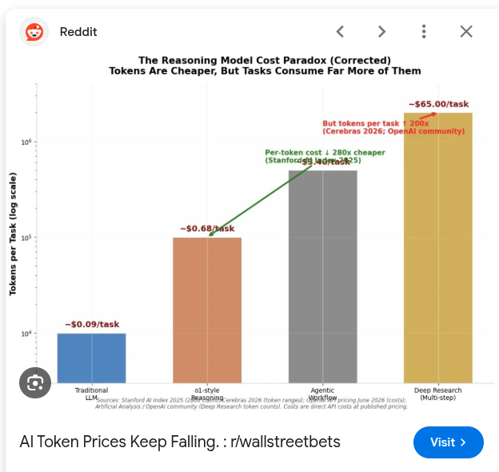

# What AI Actually Is (and Isn't)

Elephant Scale

---

## Why Start Here

You cannot govern, fund, or challenge something you can only describe in adjectives.

The goal of this module is not to make you technical. It is to make you **precise**.

By the end you will be able to sit in a vendor meeting and know which sentences mean
something and which ones are decoration.

Notes:

---

## A Short, Honest History

* **Rules** — people wrote the logic by hand. If X then Y. Expert systems.
  - Worked where the rules were knowable. Broke where they weren't.

* **Machine learning** — the computer learns the rules from examples.
  - Needed labeled data, a data science team, and a model per problem.

* **Deep learning** — many-layered models; image and speech recognition became real.

* **Foundation models** — one very large model, trained on enormous general data,
  adapted to thousands of tasks without retraining.
  - This is the break. Not a better version of the last thing — a different thing.

Notes:

The key point for leaders: before foundation models, every AI use case was a project
with a data science team attached. Now most use cases start as a configuration task.
That is what changed the economics.

---

## What Actually Changed

**Before:** one model, one problem, one team, six to eighteen months.

**Now:** one model, thousands of problems, configured in days.

The scarce resource moved. It used to be *modeling talent*. It is now
**knowing which problems are worth solving.**

That is a leadership skill, and it is why you are in this room.

Notes:

This is the thesis of the whole course. Land it hard.

---

## What a Large Language Model Actually Does

It predicts the next piece of text, over and over, very well.

That's it. There is no database of facts inside it. There is no reasoning engine
consulting a rulebook. There is a very large statistical model of how language — and
therefore, indirectly, how ideas — fit together.

> Everything impressive and everything dangerous about this technology follows from
> that one sentence.

Notes:

Do not skip this. Almost every misconception in the rest of the course — hallucination,
confidence without accuracy, why it can't do arithmetic reliably — traces back to
"it predicts text."

---

## Two Consequences You Must Internalize

**1. It is astonishingly good at language-shaped work.**
Summarizing, rewriting, drafting, classifying, extracting, translating, explaining.
Anything where the answer *is* well-formed text.

**2. It has no idea what is true.**
It produces text that *looks like* a correct answer. Usually that's the same thing.
Sometimes it very much is not.

Notes:

Ask the room: which parts of your work are "language-shaped"? You will get more hands
than people expect. Most knowledge work is language-shaped.

---

# The Vocabulary You Must Own

---

## Model

The trained system itself. The thing that does the predicting.

Models come in families and sizes. Bigger and newer is generally more capable and more
expensive per use.

**What a leader needs from this:** you will be asked "which model should we use?" The
real question underneath is *"how hard is this task, and what are we willing to pay per
answer?"* Cheap, fast models handle high volume routine work. Expensive, capable models
handle hard reasoning. Most organizations need both.

Notes:

---

## Prompt

The instruction plus the context you hand the model.

Not "the question." The whole package — the role you give it, the rules, the examples,
the data, and finally the request.

**What a leader needs from this:** the quality of your organization's AI output is
determined far more by prompt quality than by model choice. This is good news. It means
improvement is cheap and available to non-programmers. Module 2 is entirely about this.

Notes:

---

## Context Window

How much text the model can consider at once — the prompt, the attached documents, and
the conversation so far.

Modern models hold the equivalent of hundreds of pages.

**What a leader needs from this:** "can it read our 400-page manual?" is now usually
yes. "Should we paste all 400 pages every time?" is usually no — it's slow, expensive,
and dilutes attention. That trade-off is why retrieval exists.

Notes:

---

## Token

The unit models read and write in — roughly ¾ of a word.

You are billed per token, in and out.

**What a leader needs from this:** this is your unit of cost. When someone says a use
case is "too expensive," the arithmetic is tokens × price × volume, and you can do it on
a napkin. We will, in Module 8.

Notes:

---

## Training vs. Inference

**Training** — building the model. Enormous cost, done by the provider, months of
compute. You are almost certainly never doing this.

**Inference** — using the model to answer something. Milliseconds to seconds, fractions
of a cent.

**What a leader needs from this:** when a vendor says "we trained a model for you,"
ask what they actually mean. Nine times out of ten they mean they wrote a prompt.

Notes:

This slide has saved organizations real money. Emphasize the vendor question.

---

## Fine-Tuning

Taking an existing model and adjusting it on your own examples so it adopts a specific
style, format, or narrow behavior.

**What a leader needs from this:** fine-tuning teaches *behavior*, not *facts*. It is
the wrong tool for "make it know our policies" — that's retrieval. It is the right tool
for "make it always produce our report format." It costs real money and real data work,
and in 2026 it is needed far less often than vendors suggest. **Try prompting and
retrieval first.**

Notes:

---

## RAG — Retrieval-Augmented Generation

The most important acronym in enterprise AI.

1. Your question arrives
2. The system **searches your own documents** for relevant passages
3. It hands those passages to the model along with your question
4. The model answers **using that material**, and can cite it

**What a leader needs from this:** this is how AI gets to know things it was never
trained on — your procedures, your contracts, your engineering standards — without
retraining anything. It is also the single biggest lever against hallucination, because
the answer is grounded in a real document you can check.

Notes:

If they remember one acronym from two days, make it this one. Nearly every valuable
enterprise use case is RAG underneath.

---

## Agent

A system where the model doesn't just answer — it **takes actions**. It can call other
software, look things up, run a process, and decide what to do next.

**What a leader needs from this:** agents are where the value gets big and where the
risk gets real. An assistant that writes a wrong sentence wastes your time. An agent
with permission to act can do damage. The governing question for any agent is
**"what is it allowed to do, and who approves it?"** We come back to this in Module 7.

Notes:

---

## Multimodal

The model handles more than text — images, diagrams, scanned documents, audio, video.

**What a leader needs from this:** a large amount of institutional knowledge lives in
scans, photographs, drawings, and PDFs that were never machine-readable. That material
just became accessible. Look there for use cases; the competition usually isn't.

Notes:

---

## Open vs. Closed Models

**Closed / hosted** — you call the provider's model over an API. Most capable, least
effort, your data goes to their service under their terms.

**Open-weight** — the model file is published; you can run it on your own infrastructure,
including disconnected from the internet.

**What a leader needs from this:** this is a data-control and sovereignty decision
before it is a technical one. For sensitive environments the real menu is usually:
hosted service → enterprise tenant under your own control → self-hosted open model.
Each step buys control and costs capability, money, or both.

Notes:

For regulated environments, spend an extra minute here. The enterprise-tenant middle
option is the one most organizations end up choosing and the one least understood.

---

## Hallucination

When the model states something false with complete confidence.

It is not a bug that will be patched. It is a direct consequence of "it predicts text."

**What a leader needs from this:** you do not eliminate this. You **design around it** —
grounding, citations, narrow scope, human review, and matching the level of checking to
the cost of being wrong. Module 3 is entirely about this.

Notes:

---

## The Vocabulary, on One Slide

| Term | In one line | Why you care |
|---|---|---|
| Model | The trained system | Capability vs. cost per answer |
| Prompt | Instruction + context | Your cheapest quality lever |
| Context window | How much it reads at once | What fits, and what it costs |
| Token | Unit of text and billing | Your unit of cost |
| Training / inference | Building it / using it | Vendors confuse these deliberately |
| Fine-tuning | Teaching style, not facts | Usually not what you need |
| RAG | Grounding answers in your docs | How AI learns *your* business |
| Agent | AI that takes actions | Where value and risk both jump |
| Multimodal | Images, audio, scans | Unlocks non-text archives |
| Open / closed | Who runs the model | A data-control decision |
| Hallucination | Confident wrongness | Design around it, don't wish it away |

Notes:

Hand this out as a card. It is the single most-photographed slide in the course.

---

# Why AI Got Cheap

---

## The Price of a Unit of Intelligence Is Collapsing

The cost of a given level of capability has fallen by orders of magnitude, and continues
to fall. Meanwhile the capability at a given price keeps rising.

Notes:

Source: falling LLM token prices. The strategic implication is on the next slide —
don't let them leave with just the chart.

---

## What Falling Prices Change About Strategy

* **Use cases that failed the business case two years ago may pass today.**
  Re-examine your rejected list. This is free opportunity.

* **Don't over-optimize for today's prices.** Building a complex architecture to save
  token cost may be obsolete before it ships.

* **Don't build what will be a feature next year.** The single most common way to waste
  an AI budget.

* **Volume is no longer the constraint.** Ambition and data readiness are.

Notes:

Ask: what did you say no to in 2024 because it was too expensive? That is a live
opportunity list and it costs nothing to revisit.

---

## The Landscape, Briefly

* A handful of major providers offer frontier models, all broadly comparable, each
  ahead on different weeks

* The big cloud platforms all resell and host these models inside your own tenant

* A strong open-weight ecosystem exists for self-hosting

* Thousands of applications wrap these models with a user interface and a workflow

**Leader's takeaway:** do not architect your organization around one model. The models
are becoming interchangeable; your data, your processes, and your governance are not.
**Invest in the parts that don't get obsoleted.**

Notes:

Deliberately avoid naming a winner. The list would be wrong by the time the class runs
again, and the point is portability.

---

# What Is *Not* AI

---

## Automation Wearing a Costume

Plenty of things get labeled AI that aren't:

* A rules engine with a lot of if-statements
* A dashboard with a trend line on it
* A search box
* Robotic process automation clicking through screens
* A statistical forecast that has run since 1998

**None of this is bad.** Some of it is better than AI for the job — more predictable,
cheaper, auditable, already working.

The failure is calling it AI, or replacing it with AI for no reason.

Notes:

Ask the room what has been rebranded as AI inside their own organization in the last
two years. This question always produces laughter and always produces examples.

---

## The Question That Cuts Through

When someone tells you something is AI, ask:

> **"What decides the output — a person's rules, or a learned model?"**

And then:

> **"What happens when it's wrong, and how would we know?"**

If both answers are crisp, you're talking to someone who built it.
If they're vague, you're talking to someone who's selling it.

Notes:

---

# Exercise 1 — The Jargon Decoder

---

## Exercise 1 — The Jargon Decoder

**Format:** teams of 3–4, 20 minutes

Each team gets a set of real sentences taken from vendor pitches, press releases, and
internal memos.

For each one, decide:

* **Meaningful** — makes a claim we could hold someone to
* **Vague** — sounds like a claim, commits to nothing
* **Wrong** — misuses the terminology, or claims something that isn't how this works

Then: pick your worst offender and **rewrite it into something testable.**

Notes:

Full facilitator instructions, the claim set, and the answer key are in
`exercises/01-jargon-decoder.md`.

---

## Exercise 1 — Debrief

Each team reads out one original claim and its rewrite.

Watch for the patterns:

* "AI-powered" attached to something that isn't
* Training vs. prompting, deliberately blurred
* Accuracy claims with no denominator
* "Learns from your data" — meaning what, exactly?
* Capability described, accountability absent

Notes:

Close the debrief by pointing out that they just did, in twenty minutes, what most
procurement processes never do at all.

---

## Module 1 — Takeaways

* Foundation models changed the economics: the scarce skill moved from building models
  to **choosing problems**

* It predicts text. Everything good and bad follows from that

* Eleven terms is the whole vocabulary — you now own it

* Prices are falling; revisit what you rejected, and don't build tomorrow's free feature

* Ask the two questions: **what decides the output**, and **what happens when it's wrong**

---
